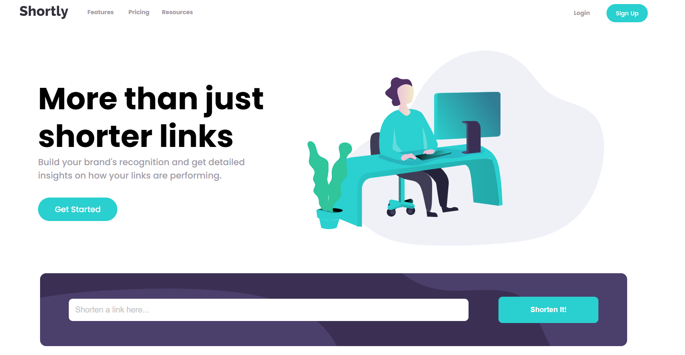

<h1 align="center">URL shortening API landing page</h1>

  <h3>
    <a href="https://github.com/Sonu-Dutta/Frontendmentor-url-shortening-api" color="white">
      Live
    </a>
     | 
    <a href="https://www.frontendmentor.io/challenges/url-shortening-api-landing-page-2ce3ob-G/hub">
      Solution
    </a>
  </h3>

   Solution for a challenge from  <a href="https://www.frontendmentor.io/" target="_blank">frontendmentor.io</a>.

 
 
 

## About The Project

The goal of this landing page challenge is integration with the shrtcode URL shortening API and playing with browser storage.
The challenge is to integrate with the shrtcode API to create shortened URLs and display them like in the designs.
You can use any JavaScript framework/library on the front-end such as React or Vue. You also have complete control over which packages you use to do things like make HTTP requests or style your project.
  Users should be able to:
 1. View the optimal layout depending on their device's screen size.
2. See hover states for all interactive elements on the page.
 
3. Shorten any valid URL.
 
4. Copy the shortened link to their clipboard in a single click.
 
  5. Receive an error message when the form is submitted if the input field is empty.
   
  6. See a list of their shortened links, even after refreshing the browser.
  
I do not have access to the Figma sketch so the design is not pixel perfect.

## Built with

- Semantic HTML5 markup
- CSS custom properties
- Flex
- Grid
- Desktop-first workflow
- Shrtco - url shortening API (old)
- Ulvis - url shortening API (current)

## What I learned

"I'm continuing to explore APIs through another small project, focusing on retrieving specific data via GET requests. While working with APIs isn't overly complex, handling dynamic DOM elements presents challenges. I've enjoyed practicing CSS and event listeners, prioritizing JavaScript over meticulously matching original designs to save time. The most challenging aspect has been persisting cached data after page reloads. Despite successfully retrieving and logging previous input data, displaying it in dynamic elements remains elusive. Although the elements persist after refresh, they appear empty. I'll revisit this project to tackle this issue."

## Useful resources

1. <a href="https://www.figma.com/">Figma</a> - Paste your design image to check the size of containers, width, etc.
2. <a href="https://chrome.google.com/webstore/detail/perfectpixel-by-welldonec/dkaagdgjmgdmbnecmcefdhjekcoceebi">Perfect Pixel</a> - Awesome Chrome extension that helps you to match the pixels of the provided design.
3. <a href="https://shrtco.de/">Shrtco</a> - url shortening API (old).
4. <a href="https://ulvis.net/developer.html">Ulvis</a> - url shortening API (current).

## Acknowledgments

A big thank you to anyone providing feedback on my <a href="https://www.frontendmentor.io/challenges/url-shortening-api-landing-page-2ce3ob-G/hub">solution</a>. It definitely helps to find new ways to code and find easier solutions!
